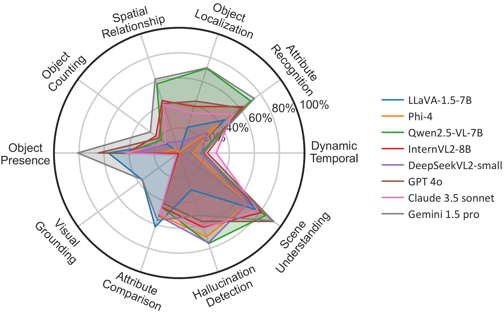
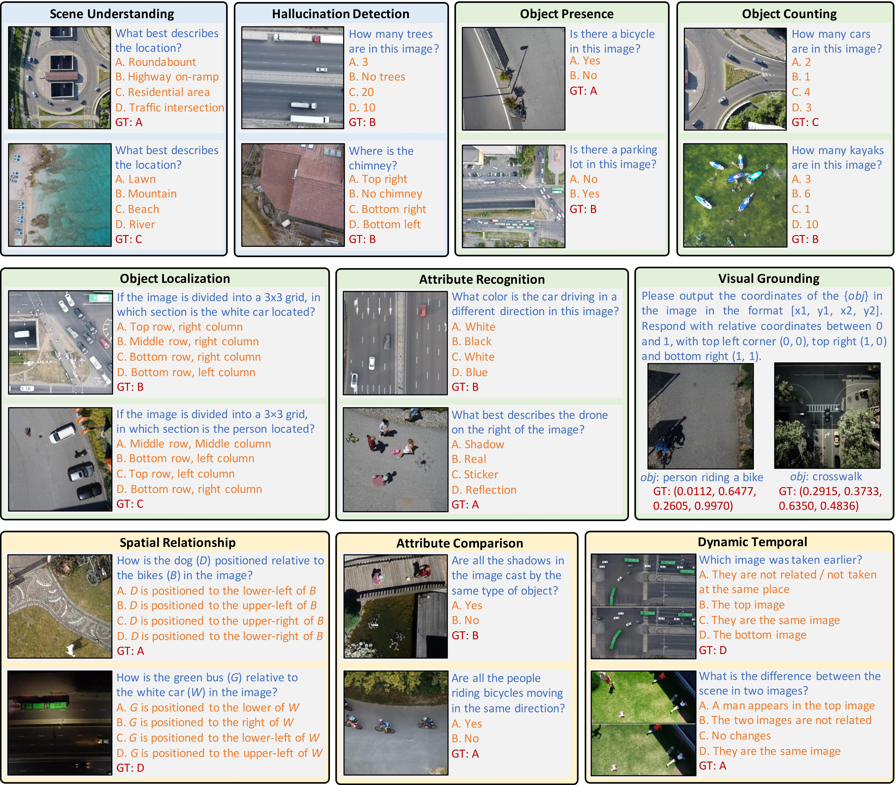
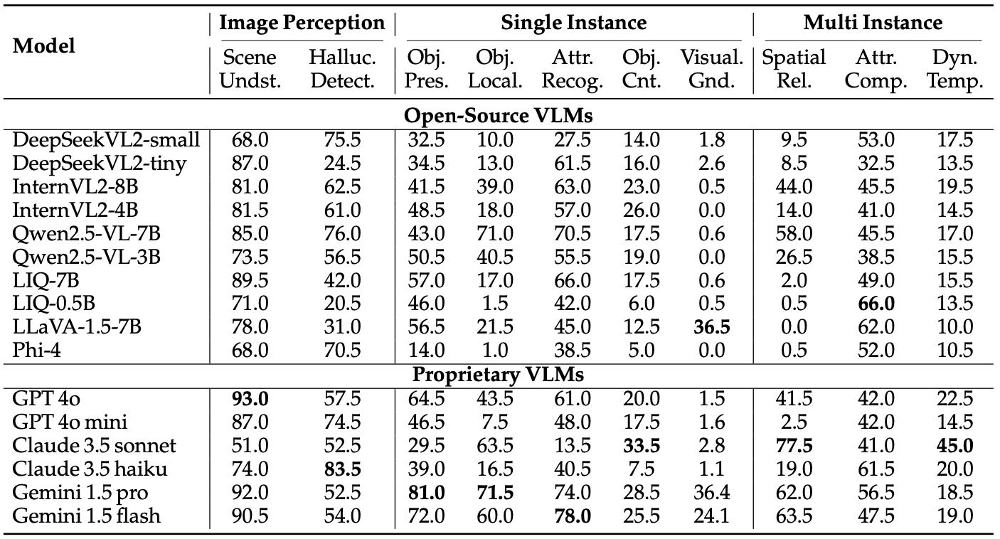
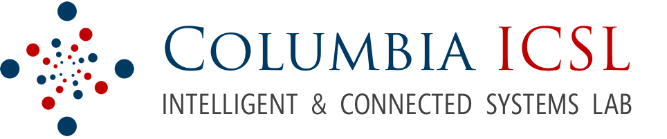

# TDBench: Benchmarking Vision-Language Models in Understanding Top-Down Images

<p align="center">
    
</p>

#### [Kaiyuan Hou](https://hou-kaiyuan.github.io/)\*, [Minghui Zhao](https://scottz.net/)\*, [Lilin Xu](https://initxu.github.io/), [Yuang Fan](https://www.linkedin.com/in/yuang-fan/), [Xiaofan Jiang](http://fredjiang.com/)
\* Equally contributing first authors

#### **Intelligent and Connected Systems Lab (ICSL), Columbia University**

[](https://arxiv.org/pdf/2504.03748)
[](https://huggingface.co/datasets/Columbia-ICSL/TDBench)


<p align="center">
   </a>
</p>
<p align="justify"> <b> Figure</b>: 8 Representative VLMs on 10 dimensions in TDBench

**<p align="justify"> Abstract:** The rapid emergence of Vision-Language Models (VLMs) has significantly advanced multimodal understanding, enabling applications in scene comprehension and visual reasoning. While these models have been primarily evaluated and developed for front-view image understanding, their capabilities in interpreting top-down images have received limited attention, partly due to the scarcity of diverse top-down datasets and the challenges in collecting such data. In contrast, top-down vision provides explicit spatial overviews and improved contextual understanding of scenes, making it particularly valuable for tasks like autonomous navigation, aerial imaging, and spatial planning. In this work, we address this gap by introducing TDBench, a comprehensive benchmark for VLMs in top-down image understanding. TDBench is constructed from public top-down view datasets and high-quality simulated images, including diverse real-world and synthetic scenarios. TDBench consists of visual question-answer pairs across ten evaluation dimensions of image understanding. Moreover, we conduct four case studies that commonly happen in real-world scenarios but are less explored. By revealing the strengths and limitations of existing VLM through evaluation results, we hope TDBench to provide insights for motivating future research. </p>


## 📢 Latest Updates
- **Apr-23-25**: Submitted pull request to VLMEvalKit repository.
- **Apr-10-25**: Arxiv Preprint is released [arxiv link](https://arxiv.org/abs/2504.03748). 🔥🔥
- **Apr-01-25**: We release the benchmark [dataset](https://huggingface.co/datasets/Columbia-ICSL/TDBench).
---

## 💡 Overview
<p align="center">
   </a>
</p>

## 🏆 Contributions

- **TDBench Benchmark.** We introduce TDBench, a benchmark designed specifically for evaluating VLMs on Top-down images originate from real scenarios is aerial operation or drone applications. We carefully curated a dataset manually comprising a total of 2000 questions.
- **Rotational Evaluation.** We introduce an evaluation strategy *RotationalEval* specifically designed for top-down images. Due to the nature of top-down images, rotations do not affect the semantic meaning, whereas this is not true and does not physically make sense naturally for front-view images.
- **Four Case Studies.** We performed 4 case studies that frequently occur in the real world.These studies evaluate specific capabilities of VLMs under controlled conditions, providing actionable insights for practical deployment while identifying critical challenges that must be addressed for reliable aerial image understanding.
<hr />

## 📊 Benchmarks Comparison

<p align="center">
   </a>
</p>


> <p align="justify"> <b> <span style="color: blue;">Table</span></b>: Overview performance of 8 open source VLMs and 6 propriety VLMs on 10 dimensions with RotationalEval method. </p>

<hr />


## 🗂️ Case Studies

Top-down images are usually captured from a relatively high altitude, which may introduce several challenges such as small object, different perspective. Furthermore, top-down images do not contain depth information in most cases, yet depth is very important for many real-world applications such as building height estimation and autonomous drone navigation and obstacle avoidance. Based on these considerations, we also conduct the following four case studies in paper.
1. **Digital Magnification for Small Object Detection**
   - Provide insights on post-processing the images to enable VLMs to see small objects

2. **Altitude Effects on Object Detection**
   - Guidelines on drones' hovering height for different object detection tasks

3. **Object Visibility and Partial Occlusion**
   - Study when objects are partially hidden or occluded by other objects

4. **Z-Axis Perception and Depth Understanding**
   - Assessing the depth reasoning from top-down images

## 🤖 How to run TDBench

TDBench is fully compatible with [VLMEvalKit](https://github.com/open-compass/VLMEvalKit). 

### Installation
1. First, install the VLMEvalKit environment by following the instructions in the [official repository](https://github.com/open-compass/VLMEvalKit)
2. Set up your model configuration and APIs according to VLMEvalKit requirements

### Datasets
* **Standard Evaluation** - Tests 9 dimensions with 4 rotation angles
  * `tdbench_rot0` (0° rotation)
  * `tdbench_rot90` (90° rotation)
  * `tdbench_rot180` (180° rotation)
  * `tdbench_rot270` (270° rotation)

* **Visual Grounding** - Tests visual grounding with 4 rotation angles
  * `tdbench_grounding_rot0` (0° rotation)
  * `tdbench_grounding_rot90` (90° rotation)
  * `tdbench_grounding_rot180` (180° rotation)
  * `tdbench_grounding_rot270` (270° rotation)

* **Case Studies** - 4 studies
  * `tdbench_cs_zoom`
  * `tdbench_cs_height` 
  * `tdbench_cs_integrity` 
  * `tdbench_cs_depth` 

### Usage Examples

#### Standard Evaluation (All Rotations)

```python
python run.py --data tdbench_rot0 tdbench_rot90 tdbench_rot180 tdbench_rot270 \
              --model <model_name> \
              --verbose \
              --work-dir <results_directory>
```

#### Visual Grounding Evaluation

```python
python run.py --data tdbench_grounding_rot0 tdbench_grounding_rot90 tdbench_grounding_rot180 tdbench_grounding_rot270 \
              --model <model_name> \
              --verbose \
              --judge centroid \
              --work-dir <results_directory>
```

#### Case Studies

Run all case studies with:

```python
python run.py --data tdbench_cs_zoom tdbench_cs_height tdbench_cs_integrity tdbench_cs_depth \
              --model <model_name> \
              --verbose \
              --work-dir <results_directory>
```

### Output

Running multiple rotations will trigger RotationalEval results in the `hit_all` column of the verbose output. Results will be saved as `xxx_REresult.csv` in your specified `<results_directory>`.
<hr />

## 📜 Citation
If you find our work and this repository useful, please consider giving our repo a star and citing our paper as follows:
```bibtex
@article{hou2025tdbench,
  title={TDBench: Benchmarking Vision-Language Models in Understanding Top-Down Images},
  author={Hou, Kaiyuan and Zhao, Minghui and Xu, Lilin and Fan, Yuang and Jiang, Xiaofan},
  journal={arXiv preprint arXiv:2504.03748},
  year={2025}
}
```


## 📨 Contact
If you have any questions, please create an issue on this repository or contact at kh3119@columbia.edu or
mz2866@columbia.edu.

---
[](http://icsl.ee.columbia.edu/)
